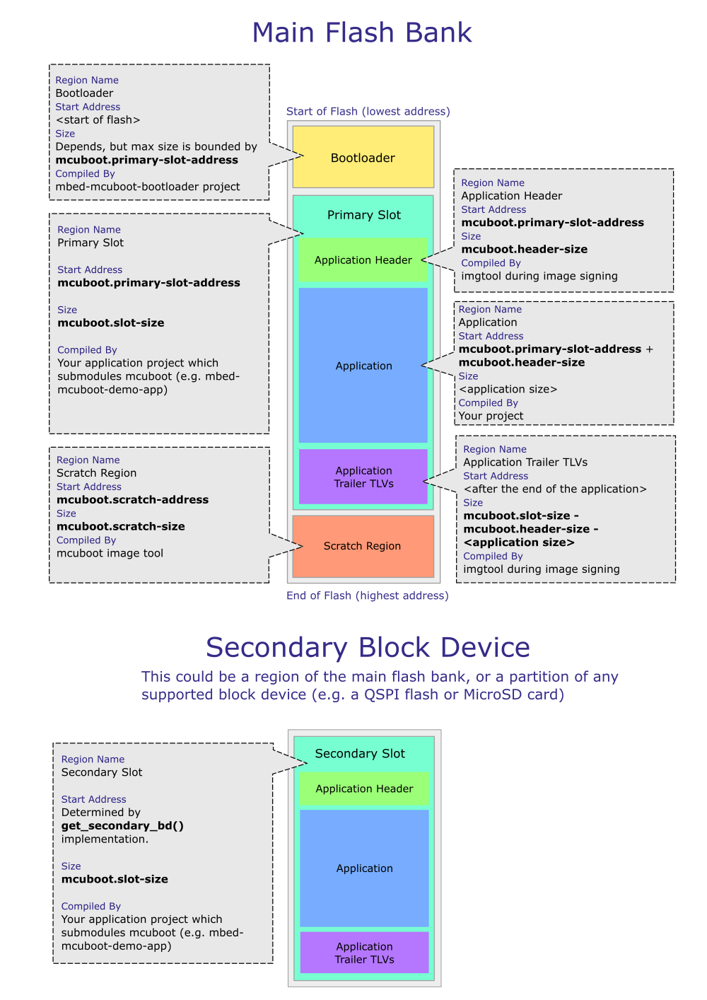

# mbed-mcuboot-demo
Demo of mcuboot with Mbed-OS

This application builds as a bootloader and should be built with the [corresponding demo application](https://github.com/mbed-ce/mbed-mcuboot-demo-app).

## Overview

Go to the [mcuboot repository](https://github.com/mcu-tools/mcuboot) for more information on mcuboot and how to configure it. This section will only cover topics specific to the mbed-os implementation.

## Memory Regions Overview

The diagram below shows the various memory regions used by mcuboot and your application. The following sections detail how the bounds of each memory region is configured.



### Bootloader
The bootloader (the application in this repository) lives in the first region of flash where the processor begins execution. The basic mcuboot bootloader does not implement any interfaces to receive updates. It simply looks at available application "slots". The application (or another bootloader) is responsible for loading application updates into a slot visible to the mcuboot bootloader. Update candidates are typically placed in the "secondary" flash region.

The bootloader has a maximum size set via `memory_bank_config`. In this project, the bootloader is set to a size of `0x20000` bytes (128kiB). This is way larger than required but allows the bootloader to be built with a debug profile during development. In production the bootloader size should be optimized based on your use case. If encryption is not used and debugging is disabled, the bootloader should be able to fit in a 64kiB region, but with encryption and/or debugging active, the needed size increases.

Upon bootup, mcuboot looks at two memory regions, one called the "primary slot" and the other called the "secondary slot", to determine if a firmware update is available and should be installed.

### Primary Slot Region

The **"primary slot"** region is typically located immediately following the end of the bootloader. The starting address of the primary slot can be configured using the JSON parameter `mcuboot.primary-slot-address`. The primary slot begins with the application header and then has the bootable main application and trailer info. 

The primary slot typically ends where the "mcuboot scratch region" begins (see Scratch Space Region below). The size (and thus the end address) of the primary slot can be configured using the parameter `mcuboot.slot-size`. Note that this parameter also configures the expected size of the secondary slot region.

**Note:** If your application uses internal flash for data storage (eg: KVStore), you must carefully configure the memory regions allocated to the primary slot, the scratch region, and your application to ensure there are no conflicts.

#### Application Header Info

The application header info section is at the beginning of the "primary memory slot".

When deciding what to boot/update, the mcuboot bootloader looks at an installed application's header info, which is a special struct prepended to the application binary. It uses this header info to validate that there is a bootable image installed in the "slot".

By default, this header is configured to be 4kB in size. This can be adjusted using the configuration parameter `mcuboot.header_size`. 

**However,** due to the way the FlashIAP block device currently works while erasing, the header_size should be configured to be the size of an erase sector (4kB in the case of an nRF52840). Erasing using the FlashIAPBlockDevice only works if the given address is erase-sector aligned! On the other hand, there is a hard upper limit of `< 65536` enforced by imgtool script. This needs to be carefully taken into consideration when choosing a MCU. Because a erase-sector of size >=4KB <64KB may actually not be available between the end of bootloader and start of primary application. For example, STM32F767/9xGx series MCU with dual bank enabled cannot satisfy this constraint. 

This header is prepended to the application binary during the signing process (explained later).

#### Primary Application

The primary application is the currently installed, bootable application. In this demo it is the UpdaterApp application. The application start address and maximum size are configured using `memory_bank_config` in mbed_app.json. The start address and size **must** be configured to avoid colliding with the bootloader and scratch space region!

#### Application TLV Trailers

There are also type-length-value (TLV) encoded pieces of information following the application binary called the "application trailer". These TLV encoded values include things like a digital signature and SHA hash, among other things. Similar to the application header info, the TLV trailers are also appended to the application hex during signing.

The space reserved for the application TLV trailers is determined from other configuration parameters. The TLV trailers reside in the memory between the **end** of the *primary application* and the **end** of the *primary slot*.

In most cases, 4kB will be plenty of room for the required TLV trailers. Enabling features such as update binary encryption increases the number of required TLV trailer entries and so you may need to adjust the size of the TLV trailer region based on your use case. During signing, the imgtool script will complain if there is not enough room for TLV trailers. On a different note, region reserved for TLV trailers doesn't have to align with erasable flash sectors. This is different from the region reserved for application header information which needs to be carefully configured to align with erasable flash sectors.

See the [mcuboot Image Trailer documentation](https://github.com/mcu-tools/mcuboot/blob/master/docs/design.md#image-trailer) for more information.

### Scratch Space Region

If configured as such, mcuboot can perform a "swap" update where it will copy the existing main application into the secondary memory region and the update candidate into the main application region. This allows mcuboot to revert the update in case of a serious firmware bug (ie: brick-proofs the update process). If the updated application fails to mark itself as "okay", mcuboot will revert the update upon the next boot cycle. 

To perform this kind of swap update, mcuboot requires a non-volatile "scratch" space in memory to store pieces of application code and update status information. This enables mcuboot to safely continue an update/revert procedure in the event of a power loss.

While the scratch region can be as small as one erase sector, making the scratch region larger will reduce wear on the scratch flash sectors when installing updates (because the entire image is swapped via the scratch sector as an intermediary).

The scratch region starting address may be specified with the configuration parameter, `mcuboot.scratch-address`. The size of the scratch space can be configured using `mcuboot.scratch-size` -- this value **must** be erase-sector aligned (ie: a multiple of the internal flash's eraseable size).

For more advanced information about configuring the scratch space region, see the [mcuboot documentation on Image Slots](https://github.com/mcu-tools/mcuboot/blob/master/docs/design.md#image-slots). For more information on swap updates, see the [mcuboot documentation on Swap Updates](https://github.com/mcu-tools/mcuboot/blob/master/docs/design.md#image-swapping)

### Secondary Slot Region

The **"secondary"** slot region is provided by you. Typically this is an external flash chip used for bulk data and firmware update storage.

The function, `mbed::BlockDevice* get_secondary_bd(void)` declared in `secondary_bd.cpp`, is used by mcuboot to retrieve the `BlockDevice` instance it will use for the secondary slot. You **must** implement this function to build the bootloader _and_ the bootable application!

This repository and the demo app both contain a default secondary_bd.cpp which uses the default block device for your Mbed board -- this will be the SPI/QSPI flash if your board has one, or a MicroSD card if your board has a slot for one.  If your board doesn't have a secondary BD available, or wish to use a different configuration, you will need to update this cpp file in both projects.

The returned BlockDevice is expected to have a size equivalent to the configuration `mcuboot.slot-size` as mentioned previously.  The default implementation uses a SlicingBlockDevice to reduce the BD size to meet this constraint.

Since the Mbed-OS mcuboot port uses Mbed's `BlockDevice` API, there is a lot of flexibility when providing the secondary memory region. For example, you can use a `FlashIAPBlockDevice` if your application is small enough to fit two copies in the internal flash. If you also use your external flash chip for data storage you can simply wrap the whole `BlockDevice` object in a `SlicingBlockDevice` with a nonzero offset to give mcuboot access to a certain region of your external flash.

## Additional Configuration

There are many configuration options available in mcuboot and these are covered in mcuboot's documentation. This section will go over basic configuration that needs to be done to boot an mbed-os application with mcuboot.

In the `mbed-mcuboot-demo-app` repository, the mcuboot repository is included to allow the application to call some application-related mcuboot functions. One use case is having the application flag itself as "okay" after an update has occurred. This prevents mcuboot from reverting the update on the next boot.

By default, the mcuboot repository/library is configured to build a bootloader, **not** an application. So when building an application with mcuboot, it is important to add the following to your `mbed_app.json` configuration file:

```
"mcuboot.bootloader-build": 0
```

Other commonly-used configuration options are:
```
"target.restrict_size",
"target.mbed_app_start",
"target.mbed_app_size",
"mcuboot.primary-slot-address",
"mcuboot.slot-size",
"mcuboot.scratch-address",
"mcuboot.scratch-size",
"mcuboot.max-img-sectors",
"mcuboot.read-granularity",
```

Many of these have been mentioned previously, and docs for them can be viewed in the [mcuboot mbed_lib.json](https://github.com/mcu-tools/mcuboot/blob/main/boot/mbed/mbed_lib.json).

**NOTE:** It is important to ensure the `mcuboot` configuration parameters are **the same** for the bootloader and the bootable application!

## Running the Demo

The demo application prints the version number of the application installed in the primary slot at startup and then walks you through performing an update.

These instructions assume that you are using a target that has existing configuration settings in the mbed_app.json of this repository.  If running this on a new target, see the next section for how to create those configs. 

### Setting up bootloader project
First, clone this project:
```shell
$ git clone --recursive https://github.com/mbed-ce/mbed-mcuboot-bootloader.git
```

Then, set up the GNU ARM toolchain (and other programs) on your machine using [the toolchain setup guide](https://github.com/mbed-ce/mbed-os/wiki/Toolchain-Setup-Guide).

Now, set up the CMake project for editing as you would normally.  Make sure to configure an upload method other than MBED, as that upload method does not allow flashing specific regions of memory by address.  We have three ways to do this:
- On the [command line](https://github.com/mbed-ce/mbed-os/wiki/Project-Setup:-Command-Line)
- Using the [CLion IDE](https://github.com/mbed-ce/mbed-os/wiki/Project-Setup:-CLion)
- Using the [VS Code IDE](https://github.com/mbed-ce/mbed-os/wiki/Project-Setup:-VS-Code)

You will probably see a CMake error like:
```
CMake Error at mcuboot/boot/mbed/mcuboot_imgtool.cmake:31 (message):
  Must specify path to valid image signing key via MCUBOOT_SIGNING_KEY CMake
  option in order to build this project.
```

That is OK and we will fix that next.

### Setting up a signing key

First we need to create a signing key, which is used by the bootloader to determine the authenticity of firmware updates.  How it works is, your update image gets a hash signed using the private key from this key pair. Then, the bootloader decrypts that hash using the public key and ensures that it matches before updating. This way, only people possessing the private key of the key pair can author valid firmware update packages.

Note: This section will only cover steps specific to setting up this project with a signing key pair and signing a main application binary. For more advanced use cases and information, such as using alternative signing algorithms to rsa-2048, see the [mcuboot documentation on Image Signing](https://github.com/mcu-tools/mcuboot/blob/master/docs/signed_images.md#image-signing).

To create the signing key, we will use imgtool, which is a python script that comes with mcuboot and gets installed into the Mbed OS virtual environment.  First we need to generate an rsa-2048 keypair:

```shell
$ mbed-mcuboot-bootloader/mbed-os/venv/bin/imgtool keygen -k signing-keys.pem -t rsa-2048
```

Note that on Windows, the path to imgtool would instead be `mbed-mcuboot-bootloader/mbed-os/venv/Scripts/imgtool`.

This command will generate a key file called signing-keys.pem in the current directory.  This file should be kept safe and likely should not be committed!

Now, we need to point CMake to that file so it can use the key. If you are using CLion or the command line, you just need to add the `MCUBOOT_SIGNING_KEY` CMake option, e.g. `-DMCUBOOT_SIGNING_KEY=../signing-keys.pem`.  This takes either an absolute path or a path relative to the source directory.

If you are using VS Code, the easiest way to do this is to add the following to your `.vscode/settings.json`:
```json
{
  "cmake.configureSettings": {
    "MCUBOOT_SIGNING_KEY": "/path/to/signing-keys.pem"
  }
}
```

### Flashing the bootloader

Once you have set up the signing key, you should now be able to configure CMake and build the project!

Then, you just need to flash the bootloader, by building the `flash-mbed-mcuboot-bootloader` target.

You should ideally see some error messages from the bootloader:
```
[ERR ][MCUb]: Image in the secondary slot is not valid!
[DBG ][MCUb]: flash area 1 open count: 1 (-)
[DBG ][MCUb]: flash area 0 open count: 2 (+)
[DBG ][MCUb]: flash area 0 open count: 3 (+)
[DBG ][MCUb]: flash area 0 open count: 2 (-)
[ERR ][MCUb]: Image in the primary slot is not valid!
[DBG ][MCUb]: flash area 0 open count: 1 (-)
[DBG ][MCUb]: flash area 2 open count: 0 (-)
[DBG ][MCUb]: deinitializing flash area block device 2...
[DBG ][MCUb]: flash area 1 open count: 0 (-)
[DBG ][MCUb]: deinitializing flash area block device 1...
[DBG ][MCUb]: flash area 0 open count: 0 (-)
[DBG ][MCUb]: deinitializing flash area block device 0...
[ERR ][BL]: Failed to locate firmware image, error: -1
```

Those are OK, we just need to install an application for it to run!

### Building and Flashing the Demo Application

Now we need to do similar steps as above for the [demo application](https://github.com/mbed-ce/mbed-mcuboot-demo-app).  Clone it (don't forget --recursive!), configure the project, and set the signing key path as before.

Then, flash the demo application by building the `flash-UpdaterApp-initial-image` target.  This is a special flash target created by the `mcuboot_generate_initial_image()` CMake function.  It flashes an alternate version of the application bin file created with imgtool that contains the mcuboot header and TLVs.

Note: Be careful that you flash the `initial-image` version of the app, not the regular `flash-UpdaterApp` target.  That will result in the app failing to boot because the bootloader thinks it's corrupt.

This demo application is somewhat special: it contains the binary update image for another application (SimpleApp) inside its application image.  This is done through some special CMake and linker tricks; see the demo app CMakeLists for details. As you will see below, the demo app flashes this image to the secondary slot and then updates to it as a demo of mcuboot functionality.

### Run the demo

Once your target has been programmed, open a serial terminal to view the debug output of the board.  Reset the board and you should see output similar to the following:

```
[INFO][BL]: Starting MCUboot
[INFO][MCUb]: Primary image: magic=good, swap_type=0x2, copy_done=0x1, image_ok=0x3
[INFO][MCUb]: Scratch: magic=bad, swap_type=0x1, copy_done=0x2, image_ok=0x2
[INFO][MCUb]: Boot source: none
[INFO][MCUb]: Image index: 0, Swap type: test
[ERR ][MCUb]: Image in the secondary slot is not valid!
[INFO][BL]: Booting firmware image at 0x21000

<Potentially random data from the UART>

[INFO][UpdaterApp]: Secondary BlockDevice inited
[INFO][UpdaterApp]: > Press button to erase secondary slot

```

### Erasing the secondary slot

By pressing the target's button (BUTTON1, if there are multiple), you will initiate erasure of the secondary slot block device in preparation for programming the update. You should see output similar to the following:

```
[INFO][main]: Erasing secondary BlockDevice...
[INFO][main]: Secondary BlockDevice erased
[INFO][main]: > Press button to copy update image to secondary BlockDevice
```

### Copying the update image

After pressing the button again, the application will copy the update binary to the secondary slot block device (typically external flash memory).

You should see output similar to the following:

```
[INFO][UpdaterApp]: Secondary BlockDevice deinited
[INFO][UpdaterApp]: > Image copied to secondary BlockDevice, press button to activate
```

### Activating the update

When performing an update, the application must tell the bootloader there is a pending update in the secondary slot. After pressing the button again, the application calls the following mcuboot utility function: `boot_set_pending(false);`

This causes the bootloader to check the secondary slot for a valid update binary.

You should see output similar to the following:

```
[DBG ][MCUb]: flash area 1 open count: 1 (+)
[DBG ][MCUb]: initializing flash area 1...
[DBG ][MCUb]: flash area 1 open count: 0 (-)
[DBG ][MCUb]: deinitializing flash area block device 1...
[INFO][UpdaterApp]: > Secondary image pending, reboot to update
```

### Performing the update

Now all you need to do to perform the update is reset your Mbed board! The mcuboot bootloader will then take over and perform the update automatically. You should see output similar to the following:

```
[INFO][BL]: Starting MCUboot
[INFO][MCUb]: Primary image: magic=good, swap_type=0x2, copy_done=0x1, image_ok=0x3
[INFO][MCUb]: Scratch: magic=bad, swap_type=0x1, copy_done=0x2, image_ok=0x2
[INFO][MCUb]: Boot source: none
[INFO][MCUb]: Image index: 0, Swap type: test
[INFO][MCUb]: Starting swap using scratch algorithm.
[INFO][BL]: Booting firmware image at 0x21000

[DBG ][MCUb]: flash area 0 open count: 1 (+)
[DBG ][MCUb]: initializing flash area 0...
[DBG ][MCUb]: flash area 0 open count: 0 (-)
[DBG ][MCUb]: deinitializing flash area block device 0...
[DBG ][MCUb]: flash area 1 open count: 1 (+)
[DBG ][MCUb]: initializing flash area 1...
[DBG ][MCUb]: flash area 1 open count: 0 (-)
[DBG ][MCUb]: deinitializing flash area block device 1...

<Potentially random data from the UART>

[INFO][SimpleApp]: Firmware update applied successfully
[INFO][SimpleApp]: Press the button to confirm, or reboot to revert the update
```

Notice that now SimpleApp is running instead of UpdaterApp! The update was performed successfully.

**Note:** After an update is performed, the new application must mark itself as "okay" to the mcuboot bootloader. If this does not occur, mcuboot will revert the update upon the next reboot (if configured to do so).

The simple application will do this when you press the button.  If you reboot without pressing the button, you will see mcuboot revert back to the updater application.

In real world situations, your application should run a self test routine to ensure it can receive updates in the future (eg: the UART software works as expected, the BLE stack initializes successfully, etc).

## Porting to New Devices
Currently, mcuboot only has existing configurations for a few Mbed targets.  If you need to run mcuboot on a different target, you will need to create the appropriate configs.

### Understanding your Target Memory Config
In order to create the memory bank config for your target, you will need to understand the layout of its flash bank(s).  The easiest way to get this information is to watch the output from the first configure of Mbed.  For example, on MIMXRT1060_EVK, I see this:
```
Summary of available memory banks:
Target RAM banks: -----------------------------------------------------------
0. SDRAM, start addr 0x80000000, size 256.0 MiB
1. SRAM_DTC, start addr 0x20000000, size 256.0 KiB
2. SRAM_ITC, start addr 0x00000000, size 128.0 KiB
3. SRAM_OC, start addr 0x20280000, size 128.0 KiB
4. SRAM_OC2, start addr 0x20200000, size 512.0 KiB

Target ROM banks: -----------------------------------------------------------
0. EXT_FLASH, start addr 0x60000000, size 8.0 MiB
```

We can see that there is exactly one ROM bank called EXT_FLASH, and its size is 8.0 MiB.  If you see multiple ROM banks instead of one, you will need to consult your target MCU's manual and linker script to determine which one is used for the main application.

The other piece of information that you need is the page and sector size of your ROM bank, and of the secondary block device if not using XIP mode. This will require a trip to your MCU datasheet, or the datasheet for the external flash for chips that don't have internal flash like the MIMXRT1060.  Note that mcuboot *can* handle flashes with non-uniform sector sizes, but you will have to be extra careful about assigning things to sectors correctly.

### Allocating Memory

Now we need to decide what slot size we're going to use and allocate the space into regions. On the MIMXRT1060_EVK we have 8MiB of flash available (quite a lot!), split into 4k erase sectors and 256 byte programmable pages.  We need to use that flash to store both the primary slot and the secondary slot. Let's say we also want to reserve a bit of space for using KVStore to store data in flash. So, let's go with:
- 128kiB (offset 0 - offset 0x20000) for the bootloader
- 3MiB for primary slot (offset 0x20000 - offset 0x320000)
- 3MiB for secondary slot (offset 0x320000 - offset 0x620000)
- 128kiB scratch space (offset 0x620000 - offset 0x640000)
- Remaining space (2MiB - 256k) for FlashIAPBlockDevice (offset 0x640000 - offset 0x800000)

### Checking the Linker Script
Before building the project, you will need to check that your device linker script has been ported to use memory banks. Unfortunately, memory bank support is a more recent feature of Mbed and the majority of devices have not had their linker scripts updated to support it yet.

To find the linker script for your target, you can watch the build output. You should see a line like this:
```
Preprocess linker script: MIMXRT1052xxxxx.ld -> mbed-mimxrt1060-evk.link_script.ld
```
This means the linker script for your target is called `MIMXRT1052xxxxx.ld`.  Search for this file in the mbed-os source tree and open it.  Look for a block like this:
```
MEMORY
{
<snip>
  m_text                (RX)  : ORIGIN = MBED_CONFIGURED_ROM_BANK_EXT_FLASH_START, LENGTH = MBED_CONFIGURED_ROM_BANK_EXT_FLASH_SIZE
<snip>
```

You want the entry in MEMORY called `m_text` or `m_flash` or `m_rom` -- wherever the code for your device is stored.

If the entry is defined in terms of `MBED_CONFIGURED_ROM_BANK` constants, this linker script has already been upgraded.  If not, and it references `MBED_APP_START` and `MBED_APP_SIZE`, or it just uses constant addresses, then this target still needs to be upgraded.

Please file a PR with mbed-ce/mbed-os asking for the linker script to be updated, or, if you are feeling adventurous, you can update the linker script yourself.  Updates can be as simple as defining the text section in terms of the `MBED_CONFIGURED_ROM_BANK` constants, though there are also a number of other fixes that are useful for older linker scripts.

### Setting Up Bootloader mbed_app.json

Based on what we've learned, we would add a new entry in mbed_app.json like:
```js
    "MIMXRT1060_EVK": {
        "target.memory_bank_config": {
            "EXT_FLASH": {
                "size": 0x20000
            }
        },

        // Primary slot is 3MiB and begins right after the bootloader
        "mcuboot.primary-slot-address": "0x60020000",
        "mcuboot.slot-size": "0x300000",

        // Use flash for secondary slot as well
        "secondary-slot-in-flash": true,
        "secondary-slot-flash-start-addr": "0x60320000",

        // Store the scratch space at the end of flash
        "mcuboot.scratch-address": "0x60620000",
        "mcuboot.scratch-size": "0x20000",

        "mcuboot.read-granularity": 1, // Flash is byte addressable

        "mcuboot.max-img-sectors": 768, // Maximum flash sectors per slot. 3MiB/4kiB = 768.
        "mcuboot.flash-block-size": 256
    },
```
Keep in mind that on MIMXRT, the flash base address in memory is 0x60000000, so we have to add that to all the offsets to get absolute addresses.

Note: Be careful of the mcuboot.max-img-sectors setting!  This needs to be the maximum number of sectors per slot in either the primary or secondary slot, whichever is greater. This means you need to check the sector size of your secondary block device too.

Note: mcuboot defaults to a flash block size of 8, i.e. it will try to program flash in chunks as small as 8 bytes. The block size on this board is much larger, so we need to increase that constant.

Now, you can flash the bootloader to your device using the steps above.  Make sure that it boots and you see some activity on the serial port before continuing.  You should see something like:
```
[INFO][BL]: Starting MCUboot
[INFO][MCUb]: Primary image: magic=bad, swap_type=0x0, copy_done=0x2, image_ok=0x2
[INFO][MCUb]: Scratch: magic=unset, swap_type=0x1, copy_done=0x3, image_ok=0x3
[INFO][MCUb]: Boot source: none
[INFO][MCUb]: Image index: 0, Swap type: none
[ERR ][BL]: Failed to locate firmware image, error: -1
```

### Setting Up Application mbed_app.json
Now we can set up the demo app.  Its mbed_app.json should look the same as the bootloader, *except* the `target.memory_bank_config` section.  We want this application to go into the application region of the primary slot. So, we must set the start address to `mcuboot.primary-slot-address` + `mcuboot.header-size` (which defaults to 0x1000).  Meanwhile, the size should be set to extend to the end of the primary slot (yes there are some TLVs after there, but the image tool will warn if there isn't enough space).

So we'd add the following block:
```js
    "MIMXRT1060_EVK": {
        "target.memory_bank_config": {
            "EXT_FLASH": {
                "start": 0x60021000, // mcuboot.primary-slot-address + mcuboot.header-size
                    "size": 0x2FF000 // mcuboot.slot-size - mcuboot.header-size
            }
        },
    
        // Primary slot is 3MiB and begins right after the bootloader
        "mcuboot.primary-slot-address": "0x60020000",
        "mcuboot.slot-size": "0x300000",

        // Use flash for secondary slot as well
        "secondary-slot-in-flash": true,
        "secondary-slot-flash-start-addr": "0x60320000",

        // Store the scratch space at the end of flash
        "mcuboot.scratch-address": "0x60620000",
        "mcuboot.scratch-size": "0x20000",

        "mcuboot.read-granularity": 1, // Flash is byte addressable

        "mcuboot.max-img-sectors": 768, // Maximum flash sectors per slot. 3MiB/4kiB = 768.
        "mcuboot.flash-block-size": 256,

        "demo-button-active-low": true
}
```

Note that we also need to add `"demo-button-active-low": true` because the user button on this board is low when pressed.

NOTE: Changes to the configured start address of flash generally require a CMake delete cache and reconfigure operation so that the MBED_UPLOAD_BASE_ADDR variable can be initialized with the right value.  So, you will need to do that if you had previously configured the project. 

## Additional Features

MCUboot integrates a number of additional features that are commonly used in bootloader situations. More details of these features can be found in the mcuboot documentation/code.

The following sections detail how to enable and use these features in your Mbed-based bootloader/application.

### [Shared Data (experimental)](https://www.mcuboot.com/documentation/design/#boot-data-sharing)

From the MCUboot documentation:

> MCUBoot defines a mechanism for sharing boot status information (also known as measured boot) and an interface for sharing application specific information with the runtime software. 

The data shared from the bootloader to the application is stored in a reserved section of RAM in the form of type-length-value (TLV) encoded entries. This allows you to share any arbitrary data from the bootloader to the application.

#### Configuration

Several configuration changes must be made in both the bootloader and application to enable this feature. Namely:

- `mcuboot.share-data` must be configured to `true`
- `mcuboot.share-data-base-address` must be set to a word-aligned memory address in RAM. Typically, a small section of RAM is reserved at the end of the MCU's RAM address space for data sharing, which brings us to the next configuration parameters
- `mcuboot.share-data-size` is set to the number of bytes you want to reserve in RAM for the shared data
- You must add the following entries to your `target.macros_add` configuration: `MBED_RAM_START=<address>` and `MBED_RAM_SIZE=<RAM size minus reserved region size>`.

**Note**: Some targets, like the K64F, do not support the macros `MBED_RAM_START` and `MBED_RAM_SIZE`. In this case, you will need to use a custom linker script. See [the README.md in the `linker` directory](https://github.com/AGlass0fMilk/mbed-mcuboot-demo/tree/master/linker).

`MBED_RAM_START` should be the starting address of RAM as per your MCU's datasheet. `MBED_RAM_SIZE` should be the total size of your MCU's RAM minus the number of bytes you are reserving for shared data. Note that the required reserved RAM depends on how many entries you want to share with the application.

As mentioned in the MCUboot documentation, the data share region has a global header that is 4 bytes. Each TLV entry has a header size of 4 bytes, plus the number of bytes required to store the data you are sharing.

Let's say you want to reserve 512 bytes of RAM for data sharing, your MCU has a RAM address space that starts at `0x20000000` and your MCU physically has 64kB of RAM. In this case, your configuration file will look as follows:

```
[...]
"mcuboot.share-data": true,
"mcuboot.share-data-base-address": "0x2000FE00",
"mcuboot.share-data-size": "0x200",
"target.macros_add": ["MBED_RAM_START=0x20000000", 
                      "MBED_RAM_SIZE=0xFE00"],
[...]
```

Calculations to get the above:

`mcuboot.share-data-size = reserved_bytes = 512`

`MBED_RAM_START = 0x20000000`

`mcuboot.share-data-base-address = MBED_RAM_START + total_RAM - reserved_bytes = 0x20000000 + 64kB - 512 = 0x20000000 + 0x10000 - 0x200 = 0x2000FE00`

`MBED_RAM_SIZE = total_RAM - reserved_bytes = 0x10000 - 0x200 = 0xFE00`

Note that you will have to add this configuration to both your bootloader and application builds. Setting `MBED_RAM_SIZE` prevents initialization code from clearing the reserved RAM region at startup, which would corrupt the shared data.

Also note that any RAM reserved for data sharing will be unavailable to the application stack/heap (TODO: fix this, better mbed-os integration), so try to keep your reserved region as small as possible.
For an example configuration that is already setup for the nRF52840_DK target, see the `mbed_app_data_sharing.json` file in this repository.

**Note:** With Mbed CLI 1, you can use the `--app-config mbed_app_data_sharing.json` option flag to use the data sharing configuration without renaming any files. Building the bootloader and application with this flag will demonstrate usage of the data sharing feature.

#### Code Changes - Bootloader

With `mcuboot.shared-data` enabled, the MCUboot bootloader expects a C function to be defined called `boot_save_shared_data`. This function provides a hook for you to add custom TLVs to the shared data region as you require. For an example implementation, see the `shared_data.c/.h` files in this repository.

#### Code Changes - Application

Once you have shared data setup and configured for both the bootloader and application, you are ready to access the shared data. During boot, the bootloader will populate the shared data RAM region with the information as you specify in the `boot_save_shared_data` function. The application may then read that information back.

An example of how to do this is built into the `mbed-mcuboot-blinky` application when `mcuboot.share-data` is set to true.

## Minimizing Code Size

A common goal of bootloader implementers is to minimize the code size of the bootloader, thereby maximizing the available space for the application. Through configuration, it is possible to acheive relatively small MCUboot-based bootloader builds.

For example, you can configure `target.printf_lib` to `minimal-printf` rather than `std` to use a reduced-feature-set version of `printf`.

You can also entirely disable logging output by setting `mbed-trace.enable` to `false`. You can also eliminate the stdio console entirely by including the following line in the `target_overrides` section of your mbed_app.json/json5 file:
```
"target.console-uart": false,
"target.console-uart-flow-control": null,
```
As a reference, with mbed-trace and console output disabled alltogether, release as build profile, and SPIF/QSPIF as secondary block device, the final image size of bootloader amounts to about 45KB. In theory 48KB reserved for bootloader should be enough, but compiler will complain if `target.restrict_size' is set at 0xC000. For budgeting purpose, a minimum 64KB or 0x10000 is needed for bootloader.
